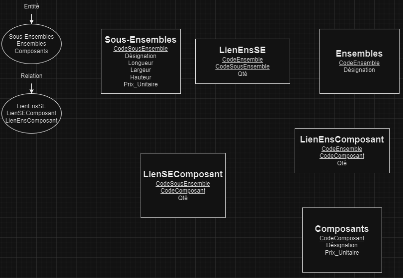

Schéma relationnel c'est la représentation de la structure d'une base de données

Dependance fonctionnelle ça décrit comment les données sont organisées dans une base de données.

entité (quelque chose qu'on stock dans la base de donnée)

dictionnaire de donnée c'st un document qui explique ce que chaque donnée dans une base de données signifie et à quoi elle sert.

MCD : Modèle Conceptuel de Données

Exo:
| Nom de la donnée  |  Format        | Longueur | Type élementaire | Type calculé | règle de calcul |  règle de gestion | Document |
| :--------------- |:---------------:| -----:| -----:| -----:| -----:| -----:| -----:|
| Prenom  |    texte      | 50 caractères  |  string |  na |  na |  na | Facture  |

Exo:

MCD:

MLD:

La cardinalité indique le nombre de relations possibles entre deux entités dans une base de données : Un à un(1,1), Un à plusieurs(1,n), Plusieurs à plusieurs(n,n), zero à plusieurs(0,n)

Exercice 1

mcd:

mld:

mpd:

Exercice 2

mpd:

mcd:

mld:

Dictionnaire:

Exercice 3:
